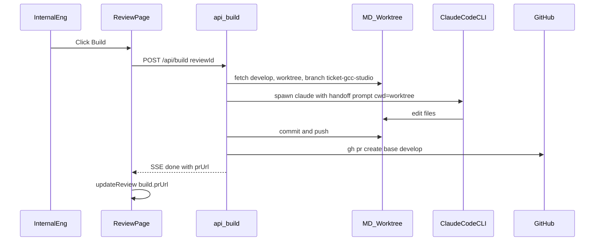

# Build → Claude Code → GitHub PR

## Goal

When a review is **approved**, internal engineers click **Build**. The server:

1. Fresh-syncs `greyorange/manager-dashboard` from `develop`
2. Creates branch `{ticketId}-gcc-studio`
3. Runs **Claude Code CLI** (same spawn pattern as `[app/api/chat/route.ts](app/api/chat/route.ts)`) with the existing handoff/agent prompt to implement real code
4. Commits, pushes, opens a PR against `**develop**`
5. Persists and shows the PR URL on the review page

## Flow




## Design choices (locked)

- **Agent**: Claude Code CLI only (`spawn("claude", ...)`), not Cursor SDK / other model SDKs.
- **Repo**: `git@github.com:greyorange/manager-dashboard.git` via existing `[MD_REPO_ROOT](.env.example)`.
- **Isolation**: Do **not** mutate the engineer’s everyday checkout. Use `git worktree add` under something like `~/.pm-orchestrator/build-worktrees/{ticketId}` created from `MD_REPO_ROOT` after `git fetch origin develop`.
- **Branch**: `{ticketId}-gcc-studio` (e.g. `AE-2149-gcc-studio`). If the branch/PR already exists, reopen/reuse or fail clearly with the existing PR link.
- **Base**: always `develop`.

## Data model

Extend `[ReviewItem](lib/types/index.ts)`:

```ts
build?: {
  status: "idle" | "running" | "succeeded" | "failed";
  branchName?: string;
  prUrl?: string;
  prNumber?: number;
  error?: string;
  startedAt?: number;
  finishedAt?: number;
};
```

Client persists via existing `repository.updateReview` (`[local-storage](lib/storage/local-storage.ts)` / `[firestore-repository](lib/storage/firestore-repository.ts)`) — same pattern as approval.

## Backend: `POST /api/build`

New route `[app/api/build/route.ts](app/api/build/route.ts)` (SSE like chat for progress):

1. **Auth / guards**: body includes `reviewId`, `ticketId`, `agentPrompt` (and optional mock HTML / change log). Reject if not approved (client should only call when approved; also accept a `status` check field).
2. **Git prepare** (shell helpers in e.g. `lib/build/git-ops.ts`):
  - `git -C MD_REPO_ROOT fetch origin develop`
  - create/reset worktree at build path on `origin/develop`
  - `git checkout -B {ticketId}-gcc-studio`
3. **Claude Code**: extract a shared spawn helper from chat (or duplicate minimally) with:
  - `cwd` = worktree path
  - system/user prompt built from `buildAgentPrompt` / handoff (`lib/utils/execution-details.ts`) + instruction to implement in this repo, do not invent scope outside the change log
  - `--allowedTools` expanded for real edits: `Read,Write,Edit,Bash` plus existing `mcp__md__*` (MCP still pointed at `MD_REPO_ROOT` or the worktree via `MD_REPO_ROOT` env override for the child)
  - stream SSE events: `status`, `log`, `error`, `done`
4. **Git finish** (`lib/build/github-pr.ts`):
  - `git add -A && git commit` with message like `feat({ticketId}): implement via GCC Studio`
  - `git push -u origin HEAD`
  - `gh pr create --base develop --head {branch} --title "..." --body "..."` (body includes ticket summary + handoff summary + Studio review link if available)
  - parse PR URL from `gh` output
5. **Env** (document in `.env.example`):
  - `MD_REPO_ROOT` (already)
  - `GH_TOKEN` or rely on machine `gh auth` / SSH (prefer `GH_TOKEN` for `gh`)
  - `BUILD_WORKTREE_ROOT` optional override
  - `GITHUB_REPO=greyorange/manager-dashboard` optional explicit

If Claude makes no file changes, fail with a clear error (no empty PR).

## UI (internal only)

On `[app/(app)/reviews/[id]/page.tsx](app/(app)`/reviews/[id]/page.tsx):

- When `review.status === "approved"` and user is internal, show a **Build** control (FAB or primary button where `ReviewDecisionFab` currently disappears after approve).
- States: idle → running (disable + progress from SSE) → succeeded (show open PR link) → failed (error + Retry).
- Persist `build` on `ReviewItem` as events arrive / on `done`.
- Surface `build.prUrl` in the header/status area and on the completed tab in `[InternalReviewsPage](components/reviews/InternalReviewsPage.tsx)` (link icon / chip).

New small components e.g. `BuildPrFab.tsx` / `BuildStatusBanner.tsx` under `components/reviews/`.

## Prompt input

Reuse existing handoff — do not regenerate mocks:

- Prefer session/review `agentPrompt` / `buildAgentPrompt()` + change log + mock HTML as reference
- Tell Claude: work only inside the worktree cwd; match manager-dashboard patterns; base implementation on approved mock and change list

## Out of scope (this pass)

- Auto-Build on approve (explicit button only)
- CI wait / merge
- Multi-repo PRs (mdbff+mdui as separate remotes) — treat monorepo as one push
- Cursor SDK

## Risk notes

- Build duration can be long → SSE + clear “running” UI; consider client abort only cancels UI listen (document that orphan Claude may continue until process exit — optional AbortSignal kill in v1).
- Dirty main `MD_REPO_ROOT` must not block builds → worktrees are mandatory.
- Requires local `claude`, `git`, `gh`, and push rights to `greyorange/manager-dashboard`.

