# Capture-Derived Page Templates for Mockup Generation

## Does this sound good?

**Yes — this is a stronger approach than the current component-snippet grounding.** Today [`pm-ui/src/capture-grounding.ts`](pm-ui/src/capture-grounding.ts) injects a ~4KB `q-table` fragment + 450KB CSS bundle into the prompt. That fixes table styling but the model still hand-builds the page shell (top bar, primary nav, sub-tabs, filter bar, section banner).

The `develop` page captures already contain the **full rendered page DOM**. Analysis shows:

| Metric                                      | Value                                                |
| ------------------------------------------- | ---------------------------------------------------- |
| Pages captured                              | 31                                                   |
| Raw HTML per page                           | ~1.65–2.17 MB (inline `<style>`/`<script>` dominate) |
| **Stripped DOM** (no style/script)          | ~3 KB – 449 KB; **median ~32 KB**                    |
| Archetypes                                  | 25 listing-table, 2 dashboard-tabs, 1 form, 3 other  |
| Shared shell variants (through `</header>`) | 26 unique hashes across 31 pages                     |

So the captures are already a gold mine — we just need to **pre-process** them into prompt-sized templates and use them as the literal starting HTML.

```mermaid
flowchart LR
  crawl["crawl.ts"] --> pages["pages/*.json\nfull DOM 1.8MB"]
  analyze["analyze-captures.ts\nNEW"] --> templates["templates/\nper-route + archetype"]
  pages --> analyze
  templates --> grounding["capture-grounding.ts\nEVOLVE"]
  grounding --> route["chat/route.ts"]
  route -->|"edit template in place"| claude["Claude"]
  claude --> inject["injectGroundingIntoHtml\nCSS bundle"]
  inject --> iframe["iframe srcDoc preview"]
```



---

## Phase 1 — Post-crawl analyzer (`pm-mcp`)

**New file:** [`pm-mcp/src/crawler/analyze-captures.ts`](pm-mcp/src/crawler/analyze-captures.ts)

Run automatically at end of [`pm-mcp/src/crawler/crawl.ts`](pm-mcp/src/crawler/crawl.ts) (and as standalone `npm run analyze-captures -w pm-mcp`).

### Per-page processing (deterministic, no LLM)

For each [`pages/<slug>.json`](pm-mcp/.cache/captures/develop/pages/audit__audit.json):

1. **Strip** all `<style>` and `<script>` blocks (CSS comes from the shared bundle in `styles/`).
2. **Truncate table bodies** — keep `<thead>` + first 2–3 `<tbody>` rows; replace remaining rows with an HTML comment `<!-- rows truncated -->`. This caps large listing pages (e.g. `outbound__ra-orders` at 449 KB stripped → ~30–40 KB).
3. **Scrub live text** — reuse [`sanitize.ts`](pm-mcp/src/crawler/sanitize.ts) logic so templates are safe fixtures.
4. **Extract region metadata** (via `node-html-parser` or `linkedom` — add lightweight dep to pm-mcp):
   - `shell`: through `</header>` (top bar + primary nav)
   - `subNav`: active sub-tab bar if present
   - `mainContent`: `q-page` / `q-page-container` inner HTML
   - `detectedComponents`, `archetype`, `strippedByteSize`
5. **Write outputs** under `captures/<label>/templates/`:
   - `per-route/<slug>.html` — full stripped + truncated page body (no `<head>` styles)
   - `per-route/<slug>.meta.json` — region offsets, archetype, route, component list

### Cross-page analysis → archetype templates

Aggregate all 31 pages into [`templates/analysis.json`](pm-mcp/.cache/captures/develop/templates/analysis.json):

```json
{
  "archetypes": {
    "listing-table": { "routes": [...], "commonPatterns": { "filterBar": "...", "sectionBanner": "...", "tableClasses": "..." } },
    "dashboard-tabs": { ... },
    "form": { ... }
  },
  "shellVariants": [{ "hash": "...", "routeCount": 3, "html": "..." }]
}
```

**Archetype base files** (3–4 files):

- `templates/archetypes/listing-table.html` — pick the **median-sized** listing page (e.g. `/downloads` at ~21 KB) as canonical; inject placeholder comments for route-specific sub-nav
- `templates/archetypes/dashboard-tabs.html` — from `/overview/v2`
- `templates/archetypes/form.html` — from `/users/access-control`

Update [`capture-store.ts`](pm-mcp/src/crawler/capture-store.ts) types + helpers:

- `readPageTemplate(label, slug)`, `readArchetypeTemplate(label, archetype)`, `readTemplateAnalysis(label)`
- Extend `CaptureManifest` with `templatesGeneratedAt` + `archetypes[]`

---

## Phase 2 — Template selection logic

**Evolve** [`pm-ui/src/capture-grounding.ts`](pm-ui/src/capture-grounding.ts):

```ts
export interface MockupGrounding {
  // existing fields...
  templateHtml: string; // full base HTML to edit
  templateSource: "per-route" | "archetype" | "none";
  templateSlug: string;
  archetype: string;
  analysisSummary: string; // compact cross-page patterns for prompt
}
```

**Selection order** (user chose "both"):

1. Keyword → route match (existing `ROUTE_HINTS` in `capture-grounding.ts`)
2. If `templates/per-route/<slug>.html` exists → use **per-route** template (best sub-nav fidelity)
3. Else fall back to **archetype** template based on ticket keywords (`table|listing` → listing-table, `overview|dashboard` → dashboard-tabs, `form|create` → form)
4. Attach compact `analysisSummary` from `analysis.json` (filter bar pattern, table class list, nav structure) — ~2 KB, not the full analysis file

Serve templates via existing static mount at `/captures/<label>/templates/...` in [`pm-mcp/src/index.ts`](pm-mcp/src/index.ts) (no new server needed).

---

## Phase 3 — Mockup pipeline: template-as-base

**Change generation model** in [`pm-ui/app/api/chat/route.ts`](pm-ui/app/api/chat/route.ts):

### Current flow (to replace for initial generation)

Model generates HTML from scratch → server injects CSS.

### New flow

1. `buildMockupGrounding()` loads `templateHtml` + `cssText`
2. System prompt: _"You are editing a captured Manager Dashboard page template. Preserve all structure, classes, and layout. Only change visible text, table cell content, column headers, status chips, and add modals if the ticket requires them."_
3. User message includes template wrapped like refinement mode:

   ```
   BASE_TEMPLATE_START
   <!DOCTYPE html>...full template...
   BASE_TEMPLATE_END

   Jira ticket: ...
   Apply ticket-specific changes to this template. Return the COMPLETE updated HTML.
   ```

4. Server still calls `injectGroundingIntoHtml(finalHtml, cssText)` before `send({ html })` — templates have no inline CSS, so injection remains essential for iframe preview.

### Prompt changes

- Replace `MANDATORY RENDERED CAPTURE GROUNDING` block (isolated q-table snippet) with `BASE PAGE TEMPLATE` block when `templateHtml` is available
- Keep isolated `q-dialog` component reference for modal-heavy tickets (from `components/` captures)
- Update `visualWorkflowInstruction()` → "edit the provided base template; do not rebuild the page shell"
- Refinement + correction retry paths: if `currentHtml` exists, prefer that over template (user already edited)

---

## Phase 4 — MCP tool (optional, low priority)

Add `get-page-template(route?)` to [`pm-mcp/src/build-server.ts`](pm-mcp/src/build-server.ts) returning template HTML + metadata. Useful for debugging; **not required** since pm-ui prefetches server-side.

---

## Size / token budget

| Source                                          | Size              | In prompt?                                |
| ----------------------------------------------- | ----------------- | ----------------------------------------- |
| Per-route template (after strip + row truncate) | ~20–45 KB typical | Yes — fits comfortably                    |
| Largest pages (pre-truncate)                    | up to 449 KB      | Truncated at analyze time                 |
| CSS bundle                                      | ~454 KB           | No — injected server-side post-generation |
| analysis.json summary                           | ~2 KB             | Yes — structural hints only               |

---

## Files to create / modify

| File                                     | Action                                                 |
| ---------------------------------------- | ------------------------------------------------------ |
| `pm-mcp/src/crawler/analyze-captures.ts` | **Create** — core analyzer                             |
| `pm-mcp/src/crawler/capture-store.ts`    | Extend types + template read/write                     |
| `pm-mcp/src/crawler/crawl.ts`            | Call analyzer after crawl completes                    |
| `pm-mcp/package.json`                    | Add `analyze-captures` script + `node-html-parser` dep |
| `pm-ui/src/capture-grounding.ts`         | Load templates, archetype fallback, new fields         |
| `pm-ui/app/api/chat/route.ts`            | Template-as-base generation flow                       |
| `pm-mcp/.env.example`                    | Document `CRAWL_ANALYZE_TEMPLATES=true` (default on)   |

---

## Test plan

1. Run analyzer on existing `develop` captures: `npx tsx src/crawler/analyze-captures.ts --label develop`
2. Verify `templates/per-route/outbound__ordersV2.html` is ~30–50 KB, contains `q-layout`, `q-table`, no `<style>` blocks
3. Verify `templates/archetypes/listing-table.html` exists and `analysis.json` lists 25 listing routes
4. Generate mockup for an outbound ticket → response HTML should preserve captured nav/sub-tabs; table uses real Quasar classes
5. Inspect iframe output: `<style data-md-capture-css>` present, table rows match real MD styling
6. Refinement on generated mockup still works (edits `currentHtml`, not re-loading template)
