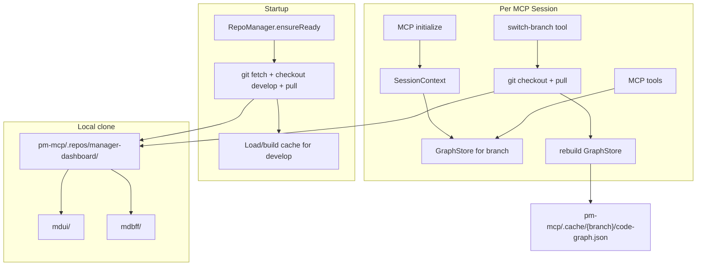

# MCP Repo Sync and Per-Session Branch Switching

## Assessment

Yes — this is a solid design for pm-mcp:

- **Startup pull from `develop`** keeps the code graph aligned with the latest monorepo without manual steps.
- **Per-session branch switching** lets Cursor/Claude Desktop users analyse feature branches without affecting other clients.
- **Code-only refresh** (your choice) keeps the bundled markdown context in [`pm-mcp/src/context/`](pm-mcp/src/context/) stable while `mdui/` + `mdbff/` parsing reflects the active branch.

Main constraints to handle upfront:

| Constraint                                     | Mitigation                                                                                                  |
| ---------------------------------------------- | ----------------------------------------------------------------------------------------------------------- |
| Private repo via SSH                           | Use `git@github.com:greyorange/manager-dashboard.git`; fail fast with a clear error if SSH keys are missing |
| First startup is slow (clone + index ~30–60s)  | Log progress; warm-cache `develop` before accepting MCP traffic                                             |
| Current MCP is stateless + singleton graph     | Move to **stateful sessions** with one `GraphStore` per session                                             |
| Cache path assumes `poc-mcp` lives inside repo | Move caches to `pm-mcp/.cache/{branch}/` (independent of clone location)                                    |

## Target architecture



## File changes (pm-mcp only)

### 1. New `RepoManager` — [`pm-mcp/src/repo-manager.ts`](pm-mcp/src/repo-manager.ts)

Responsible for all Git operations against a dedicated local clone:

- **Clone dir:** `pm-mcp/.repos/manager-dashboard/` (gitignored)
- **Remote:** `git@github.com:greyorange/manager-dashboard.git` (env override `REPO_URL`)
- **Default branch:** `develop` (env `REPO_DEFAULT_BRANCH`)

Core methods:

```typescript
ensureReady(): Promise<RepoState>   // clone if missing; fetch + checkout + pull default branch
switchBranch(branch: string): Promise<RepoState>  // fetch, checkout, pull target branch
getRepoRoot(): string               // path to clone root (mdui/ + mdbff/ parent)
getCurrentState(): RepoState        // branch, commit SHA, lastSyncedAt
```

Use **`simple-git`** (add to [`pm-mcp/package.json`](pm-mcp/package.json)) instead of raw `execSync` for safer fetch/checkout/pull error handling.

Startup sequence in [`pm-mcp/src/index.ts`](pm-mcp/src/index.ts):

1. `await repoManager.ensureReady()` **before** `app.listen()`
2. Log branch + commit SHA
3. Optionally pre-warm `develop` index (see step 3)

### 2. New `SessionManager` — [`pm-mcp/src/session-manager.ts`](pm-mcp/src/session-manager.ts)

Holds per-session state:

```typescript
interface SessionContext {
  sessionId: string;
  branch: string;
  commit: string;
  graph: GraphStore; // instance per session (not the module singleton)
  indexReady: boolean;
  indexStatus: string;
  createdAt: number;
}
```

Responsibilities:

- Create session on MCP initialize (default branch = current repo branch, usually `develop`)
- `switchBranch(sessionId, branch)` → delegates to `RepoManager`, clears session graph, rebuilds index
- `ensureIndexed(sessionId)` → load from branch cache or build fresh
- TTL cleanup for idle sessions (e.g. 2h) to limit memory

### 3. Refactor graph/index wiring

**[`pm-mcp/src/parser/indexer.ts`](pm-mcp/src/parser/indexer.ts)** — update cache paths:

```typescript
// Before (breaks when clone is separate from poc-mcp):
path.join(repoRoot, "poc-mcp", "pm-mcp", ".cache", "code-graph.json");

// After:
path.join(PM_MCP_ROOT, ".cache", branch, "code-graph.json");
```

Also store `branch` + `commit` in `CacheHeader` so stale caches are invalidated when HEAD changes.

**[`pm-mcp/src/build-server.ts`](pm-mcp/src/build-server.ts)** — refactor from module-level singleton:

```typescript
// Before: export function buildMcpServer(): McpServer
//         uses module-level codeGraph, repoRoot, indexReady

// After:  export function buildMcpServer(ctx: SessionContext): McpServer
//         all code-graph tools read ctx.graph + ctx.branch
```

Markdown context loaders (`loadCtx`) stay pointed at bundled [`pm-mcp/src/context/`](pm-mcp/src/context/) — unchanged.

### 4. New MCP tools

Add to [`build-server.ts`](pm-mcp/src/build-server.ts):

| Tool                 | Purpose                                                                                                |
| -------------------- | ------------------------------------------------------------------------------------------------------ |
| `get-repo-status`    | Returns active branch, commit SHA, index status, last sync time                                        |
| `switch-branch`      | Args: `{ branch: string, forcePull?: boolean }` — checkout + pull + re-index **for this session only** |
| `rebuild-code-index` | Update existing tool to operate on session graph (already exists, wire to session)                     |

`list-branches` (optional, nice-to-have): `git branch -r` trimmed list for discoverability.

### 5. Stateful MCP transport — [`pm-mcp/src/index.ts`](pm-mcp/src/index.ts)

Switch from stateless to stateful Streamable HTTP:

```typescript
// Before
sessionIdGenerator: undefined;

// After
sessionIdGenerator: () => randomUUID();
```

Maintain `Map<sessionId, { server: McpServer, context: SessionContext }>`:

- **New session (no `mcp-session-id` header):** create `SessionContext`, build `McpServer`, store in map
- **Existing session:** reuse stored server + context
- Pass session ID back via transport response headers (MCP SDK handles this in stateful mode)

Enhance `/health` to report: `{ branch, commit, activeSessions, defaultBranch }`.

### 6. Environment and gitignore

Update [`pm-mcp/.env.example`](pm-mcp/.env.example):

```env
REPO_URL=git@github.com:greyorange/manager-dashboard.git
REPO_DEFAULT_BRANCH=develop
REPO_AUTO_PULL=true          # pull on startup (default true)
REPO_CLONE_DIR=.repos/manager-dashboard
MCP_PORT=3100
```

Update [`.gitignore`](.gitignore):

```
pm-mcp/.repos/
pm-mcp/.cache/
```

Remove `REPO_ROOT=../..` as the primary mechanism — clone dir replaces it. Keep `REPO_ROOT` as optional override for local dev (skip clone, use existing checkout).

### 7. pm-ui impact (minimal)

No branch UI required for v1. [`pm-ui/src/mcp-client.ts`](pm-ui/src/mcp-client.ts) continues to work against the default `develop` session.

Optional follow-up (not in v1): persist `mcp-session-id` across chat requests if pm-ui needs its own branch picker later.

### 8. Documentation

Update [`README.md`](README.md) with:

- SSH prerequisite (`ssh -T git@github.com`)
- First-run timing expectations
- How to switch branches via MCP tool from Cursor
- Manual override: `REPO_ROOT` for developers who already have the monorepo checked out locally

## Startup and session flows

**Server boot:**

1. Clone/pull `develop` via SSH
2. Warm-load `develop` cache (or build if missing)
3. Start HTTP listener

**New MCP client connects (Cursor / pm-ui):**

1. Initialize → new session bound to `develop` (or whatever repo is currently checked out)
2. Session loads branch cache into its own `GraphStore`

**User calls `switch-branch { branch: "feature/GM-123" }`:**

1. Git fetch + checkout + pull in shared clone (serialized via mutex — only one checkout at a time)
2. Clear session graph → rebuild from `pm-mcp/.cache/feature-GM-123/` or fresh scan
3. Return new branch + index stats

> **Note:** Git checkout is process-global (one working tree). Concurrent sessions on _different_ branches require either a mutex (one active branch at a time in the clone) or git worktrees (v2 enhancement). For v1, use a **checkout mutex** with clear tool response: _"another session is switching branches, retry in N seconds"_.

## Implementation todos
