# Rendered Capture Crawler for Grounded Mockups

## Goal

Crawl a live, logged-in Manager Dashboard, capture each page/modal's **rendered HTML + compiled CSS + screenshot**, persist as JSON "capture maps," and surface them through `pm-mcp` so Claude builds HTML mockups from real rendered components instead of hand-written CSS.

## Nature of the process (important)

This is a **one-time, offline, dev-only build step** — not a runtime service:

- Auth happens **once per crawl run** (interactive login), and only needs to last for the duration of that single run. After the crawl, captures are static files committed/kept locally; nothing re-authenticates and there is no token to keep alive. Token expiry is therefore **not** an ongoing risk — at most you re-run `crawl:login` if a crawl spans longer than a session.
- The mockup pipeline reads only the **static captured fixtures** (HTML/CSS/PNG). It never touches the live app or live data after capture, so there is no live-data exposure at mockup time.
- Re-run the crawl manually only when you want to refresh the captured baseline (e.g. after a UI change in the real app).

## Why crawler over an in-repo Vue app

- The HTML pipeline already exists end-to-end ([chat/route.ts](pm-ui/app/api/chat/route.ts)); we only need to add a _rendered_ ground-truth source.
- A Vue mockup app would require mocking the whole Apollo/GraphQL BFF, seeding data, and bypassing Keycloak — a second app to maintain. Deferred, not chosen.

## Architecture

```mermaid
flowchart LR
  liveApp["Live Manager Dashboard (Keycloak + GraphQL data)"]
  crawler["pm-mcp/src/crawler (Playwright)"]
  store["Capture store (.cache/captures/<branch>/)"]
  mcp["pm-mcp MCP tools/resources"]
  ui["pm-ui chat route -> Claude"]
  mock["HTML mockup in iframe"]

  liveApp -->|"render + DOM + CSS"| crawler
  crawler -->|"JSON maps + css bundle + png"| store
  store --> mcp
  mcp -->|"prefetch + tool calls"| ui
  ui --> mock
```

`pm-mcp` stays the ground-truth service; the crawler is an offline command that writes into the existing `.cache/` area, and the running MCP server serves captures the same way it already serves the code graph.

## Capture store layout (new)

Under `pm-mcp/.cache/captures/<branch>/`:

- `manifest.json` — index: routes captured, timestamps, app commit/build, list of component + modal snapshot ids.
- `pages/<routeSlug>.json` — `{ route, url, title, html (sanitized), screenshot, cssBundleId, detectedComponents[], modals[] }`.
- `components/<id>.json` — `{ componentKey (e.g. q-table), sourceMatch (mdui/...vue if mapped), renderedHtml, screenshot }`.
- `styles/<hash>.css` — compiled global CSS bundle(s), deduped by hash (shared across pages).
- `screenshots/*.png`.

## Phase 1 — Crawler skeleton + auth + page capture

- Add `playwright` to [pm-mcp/package.json](pm-mcp/package.json) devDeps; add scripts `crawl` and `crawl:login`.
- New `pm-mcp/src/crawler/`:
  - `auth.ts` — `crawl:login` runs headed once, user logs in via Keycloak, save `storageState.json` (cookies/localStorage); headless runs reuse it.
  - `config.ts` — reads `CRAWL_BASE_URL`, `CRAWL_STORAGE_STATE`, route seeds (from `mdui` router and/or `site-map.md`).
  - `capture-page.ts` — for each seed route: `goto`, wait for `networkidle` + Quasar mount, capture `document.documentElement.outerHTML`, full-page screenshot, and the resolved CSS (concatenate `<link rel=stylesheet>` + `<style>` contents → hash → store once).
  - `crawl.ts` — orchestrates: load seeds, BFS in-origin links (depth-limited), write `pages/*.json` + `manifest.json`.
- `.env.example` additions in `pm-mcp` for `CRAWL_*` vars.

## Phase 2 — Modal/dialog + interactive capture

- `capture-interactions.ts`: on each page, enumerate likely triggers (buttons, menu items, row action icons), click, detect newly-mounted `.q-dialog`/`.q-menu`/`.q-drawer`, capture subtree HTML + screenshot, then close (Esc/backdrop). Record under the page's `modals[]` and as `components/*.json`.
- Guardrails: skip destructive actions (delete/submit) via text/label denylist; cap clicks per page.

## Phase 3 — Component snapshot library + source mapping

- `extract-components.ts`: from captured DOM, slice self-contained subtrees keyed by root class (`q-table`, `q-btn`, `q-card`, `q-chip`, app component roots). Map to source where possible by reusing the existing graph/`component-catalog.ts` (class/name heuristics).
- Deduplicate near-identical snapshots; keep a representative per component key.
- Optional `sanitize.ts`: scrub live data (warehouse names, counts, PII) by replacing text nodes with placeholders while preserving structure/classes — note this as a config toggle.

## Phase 4 — Expose via MCP

In [build-server.ts](pm-mcp/src/build-server.ts) (same `server.tool(...)` / `registerResource` pattern):

- `list-captured-pages` — routes with screenshots + component counts.
- `get-captured-page` — sanitized rendered HTML + screenshot path + CSS bundle id for a route.
- `list-rendered-components` / `get-rendered-component` — real rendered HTML subtree + applicable CSS for a component key.
- Serve `styles/*.css` and `screenshots/*.png` over the existing Express server (`pm-mcp/src/index.ts`) at a static path so mockups can reference an absolute URL (iframe `srcDoc` breaks on relative paths — same constraint the icon tools already handle).
- New `loadCapture*` helpers reading `.cache/captures/<branch>/`.

## Phase 5 — Wire into the mockup pipeline

- Add bridge fns in [mcp-client.ts](pm-ui/src/mcp-client.ts) (mirroring `fetchComponentCatalog`): `fetchCapturedPageCatalog`, `fetchRenderedComponent`.
- In [chat/route.ts](pm-ui/app/api/chat/route.ts) `buildSystemPrompt`, add a "RENDERED REFERENCE" section + workflow: call `list-captured-pages` / `get-rendered-component` to fetch real rendered HTML, link the captured CSS bundle (absolute URL) as the mockup base stylesheet, and adapt real fragments rather than authoring CSS. Keep the existing `RAW_HTML_COMPONENT_START/END` + reuse-manifest contract.
- Optionally extend `validate-ui-references` to also accept captured-component ids.

## Risks / decisions to confirm during build

- CSS bundle size (Quasar bundles are large) — fine for iframe; serve via HTTP, don't inline by default.
- Crawl fragility on dynamic routes/IDs — start with sitemap's main routes, expand iteratively.
- Captured snapshots go stale when the real app UI changes — refresh by re-running the crawl manually; record app commit/build in `manifest.json` so staleness is visible.
- (Not a runtime concern) Auth is one-time per crawl run; no live data is read after capture. Sanitization (Phase 3) is optional, only relevant if captured fixtures are shared beyond the local dev machine.

## Deferred (not building now)

- In-repo Vue mockup app (needs mocked BFF + auth bypass). Revisit only if HTML fidelity proves insufficient.
