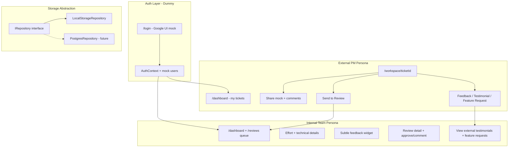
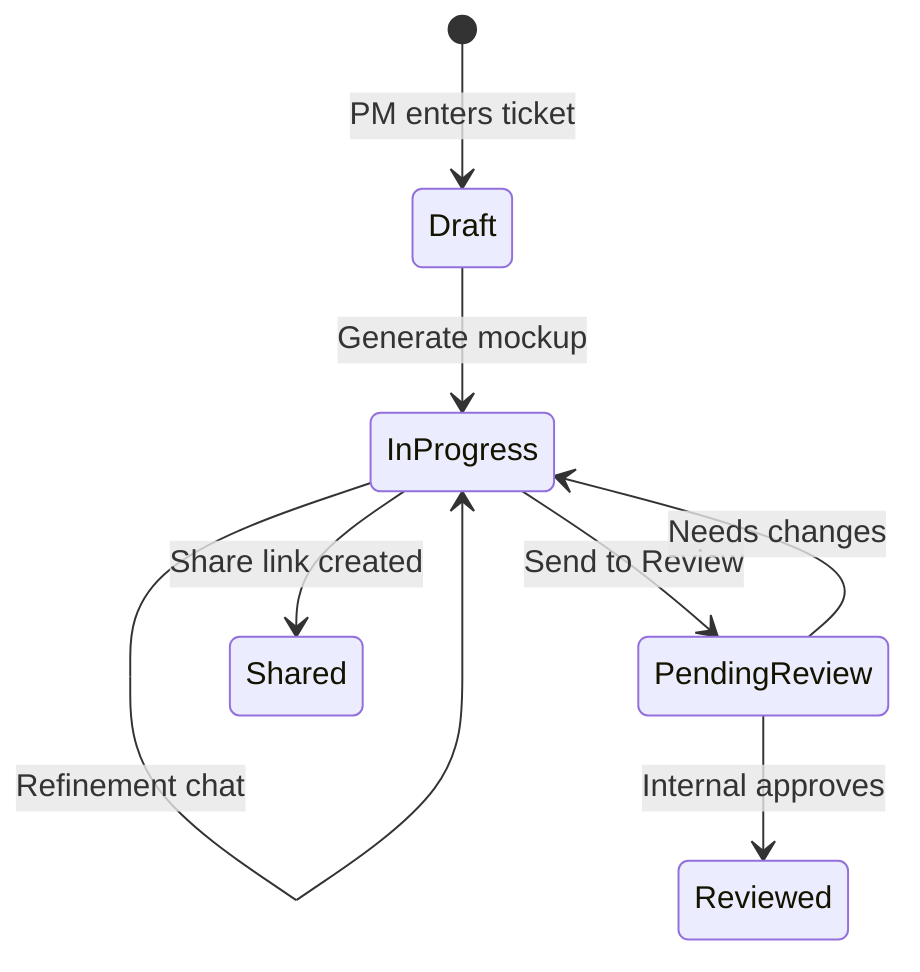

# Standalone Product Frontend Plan

## Current State

The app is a **single 1,100-line client page** ([app/page.tsx](app/page.tsx)) with:
- JIRA ticket → mockup generation pipeline (working)
- Session persistence in `localStorage` only (`poc-mcp-v2-{ticketId}`)
- Effort estimation already parsed and rendered (`effortEstimation` field + `EFFORT_MARKER` in chat)
- No auth, no user isolation, no sharing or review workflow

Your constraints: **dummy auth for now**, **localStorage for now**, but **architect for future DB/auth swap**.

---

## Target Product Architecture



---

## Phase 1 — Foundation: Routing, Auth Shell, Storage Layer

### 1a. Split the monolith into routes

| Route | Purpose | Access |
|-------|---------|--------|
| `/login` | Google sign-in UI (dummy) | Public |
| `/dashboard` | User's ticket session list | Authenticated |
| `/workspace/[ticketId]` | Mockup workspace (existing flow) | Authenticated |
| `/reviews` | Pending review queue | Internal only |
| `/reviews/[id]` | Review detail view | Internal only |
| `/share/[shareId]` | Read-only shared mock + comments | Public (link) |

Move root `/` to redirect based on auth state.

### 1b. Dummy auth (UI-only, swappable later)

Create [`lib/auth/`](lib/auth/):
- `types.ts` — `User`, `UserRole: 'external' | 'internal'`
- `mock-users.ts` — 2 seed users (e.g. `pm@partner.com` external, `engineer@greyorange.com` internal)
- `auth-context.tsx` — React context; persists `currentUser` in `localStorage` key `gor-auth`
- `auth-provider.tsx` — wraps app in [`app/layout.tsx`](app/layout.tsx)

Login page: styled Google button → picks mock user or shows a **dev persona picker** (External PM / Internal Engineer).

**Future swap point:** replace `signInWithGoogle()` stub with NextAuth / Supabase Auth — context API stays the same.

### 1c. Storage repository abstraction

Create [`lib/storage/`](lib/storage/):

```typescript
interface IRepository {
  // Sessions (scoped to userId)
  getSessions(userId: string): Promise<MockupSession[]>
  getSession(userId: string, ticketId: string): Promise<MockupSession | null>
  saveSession(session: MockupSession): Promise<void>

  // Reviews
  getReviews(filter?: ReviewFilter): Promise<ReviewItem[]>
  createReview(item: ReviewItem): Promise<void>
  updateReview(id: string, patch: Partial<ReviewItem>): Promise<void>

  // Shares & comments
  createShare(share: SharedMock): Promise<string>
  getShare(shareId: string): Promise<SharedMock | null>
  getComments(targetId: string): Promise<Comment[]>
  addComment(comment: Comment): Promise<void>

  // User engagement (feedback, testimonials, feature requests)
  saveEngagement(item: UserEngagement): Promise<void>
  getEngagement(filter: EngagementFilter): Promise<UserEngagement[]>
}
```

Implement `LocalStorageRepository` now; export a singleton `repository` from [`lib/storage/index.ts`](lib/storage/index.ts).

**Key change from today:** session keys become `gor-session-{userId}-{ticketId}` so each user has isolated history.

Migrate existing types from [app/page.tsx](app/page.tsx) lines 6–50 into [`lib/types/`](lib/types/).

---

## Phase 2 — External PM Experience

### 2a. Dashboard (`/dashboard`)

- Header: user avatar, name, role badge, "New Ticket" CTA
- Ticket list: all sessions for current user (ticket ID, summary, status, last updated)
- Status chips: `Draft` | `In Progress` | `Sent for Review` | `Reviewed`
- Click row → `/workspace/[ticketId]`

### 2b. Workspace (refactor existing flow)

Extract from [app/page.tsx](app/page.tsx) into focused components under `components/workspace/`, `components/chat/`, `components/usage/`.

Keep existing SSE chat logic in a `useMockupGeneration` hook — behavior unchanged, just relocated.

**Workspace toolbar actions (new):**
- **Share** — snapshots current mockup → share link → copy-to-clipboard modal
- **Send to Review** — sets session status to `pending_review`, creates `ReviewItem`

External users see **no effort estimation block** (gate with `user.role === 'internal'`).

### 2c. External engagement widget (Feedback + Testimonial + Feature Request)

After each conversation turn (or when the user finishes a mockup session), show a **subtle inline engagement bar** for external PMs only:

```
How was this session?
  👍 Feedback   💬 Testimonial   💡 Feature Request
```

Three lightweight actions, each opening a small slide-over or inline form (not a full modal — keep it subtle):

| Action | Purpose | Fields |
|--------|---------|--------|
| **Feedback** | Rate the AI/mockup quality for this session | Thumbs up/down + optional one-line note |
| **Testimonial** | Share a quote about the product experience | Short text (max ~200 chars) + optional "use my name" toggle |
| **Feature Request** | Suggest product improvements | Title + description (free text) + optional priority (Nice to have / Important) |

**UX principles:**
- Appears below the last assistant message, fades in gently — same subtle treatment as internal feedback
- Non-blocking — dismisses after submit or on ignore
- Only one submission per type per session (show "Submitted" state if already done)
- Stored via repository as `UserEngagement` with `type: 'feedback' | 'testimonial' | 'feature_request'`

```typescript
interface UserEngagement {
  id: string
  userId: string
  sessionId: string
  ticketId: string
  type: 'feedback' | 'testimonial' | 'feature_request'
  rating?: 'positive' | 'negative'        // feedback only
  text?: string                           // feedback note or testimonial quote
  title?: string                          // feature request only
  description?: string                    // feature request only
  priority?: 'nice_to_have' | 'important' // feature request only
  showName?: boolean                      // testimonial only
  createdAt: number
}
```

### 2d. Share page (`/share/[shareId]`)

- Read-only mockup iframe
- Ticket summary header
- Comment thread below mockup
- Comment input (guest name field for unauthenticated viewers)

---

## Phase 3 — Internal Team Experience

Internal users get **everything external has**, plus:

### 3a. Review queue (`/reviews`)

- Table/cards of items with status `pending_review`
- Columns: ticket ID, summary, submitted by (PM name), submitted at, mockup thumbnail
- Click → `/reviews/[id]` with full session context, mockup, chat history, PM comments

Internal actions on review detail:
- Add internal comment
- Mark as `approved` | `needs_changes` | `reviewed`

Nav: show **Reviews** tab in app shell only when `user.role === 'internal'`.

### 3b. Internal view of external engagement

On the review detail page (and a future `/insights` stub), internal users can see engagement submitted by the external PM for that session:
- Feedback rating + note
- Testimonial quote (if submitted)
- Feature requests linked to the ticket

This gives internal reviewers context beyond the mockup itself.

### 3c. Role-gated AI technical output

**Backend** — [app/api/chat/route.ts](app/api/chat/route.ts):
- Accept `userRole: 'external' | 'internal'` in POST body
- Effort estimation block (lines 562–577) **only appended when `userRole === 'internal'`**
- For external: product-focused analysis only — no engineering estimates, file paths, or story points
- Strip any leaked `EFFORT_MARKER` content server-side for external role

**Frontend** — hide `EffortMarkdown` block and MCP tool references for external users.

### 3d. Internal feedback widget (internal only)

Separate from the external engagement bar — a simpler inline widget for internal users after assistant messages:

```
Was this helpful?  👍  👎   [optional one-line note]
```

- Feedback only (no testimonial/feature request — those are external-facing product signals)
- Stores to same `UserEngagement` repository with `type: 'feedback'`

---

## Phase 4 — App Shell & Polish

### 4a. Shared layout

[`app/(app)/layout.tsx`](app/(app)/layout.tsx):
- Top nav: Logo | Dashboard | Reviews (internal) | user menu
- Consistent with existing design tokens from [app/page.tsx](app/page.tsx)
- Responsive: collapse ticket panel on mobile

### 4b. Session lifecycle states



### 4c. Migrate existing localStorage data

One-time migration from old `poc-mcp-v2-*` keys to `gor-session-{userId}-*`.

---

## Persona Feature Matrix

| Feature | External PM | Internal Team |
|---------|:-----------:|:-------------:|
| JIRA ticket entry + mockup | Yes | Yes |
| Conversation history (per user) | Yes | Yes |
| Share mock + comments | Yes | Yes |
| Send to Review | Yes | Yes |
| Feedback (session quality) | Yes | Yes |
| Testimonial | Yes | No |
| Feature Request | Yes | No |
| View external engagement on review | No | Yes |
| Effort estimation + technical details | No | Yes |
| Review queue + approve/reject | No | Yes |

---

## What We Are NOT Building Now (deferred)

- Real Google OAuth / GreyOrange ID validation
- Server-side database (Postgres, Supabase)
- Real-time collaboration (WebSockets)
- Email/Slack notifications on "Send to Review"
- Per-user JIRA OAuth tokens
- Cloud deployment of Claude CLI

Each has a clear **swap point** (auth context, repository interface, review creation hook).

---

## Implementation Order

1. **Storage layer + types** — foundation including `UserEngagement` model
2. **Auth context + login page + route guards**
3. **Extract components + workspace route** — migrate existing flow
4. **Dashboard + per-user sessions**
5. **Share + comments**
6. **Send to Review + review queue**
7. **External engagement widget** (feedback + testimonial + feature request)
8. **Role-gated AI output + internal feedback widget**
9. **App shell polish + localStorage migration**

Estimated scope: ~28–32 new files, refactor of [app/page.tsx](app/page.tsx) into ~10 components + 2 hooks.
